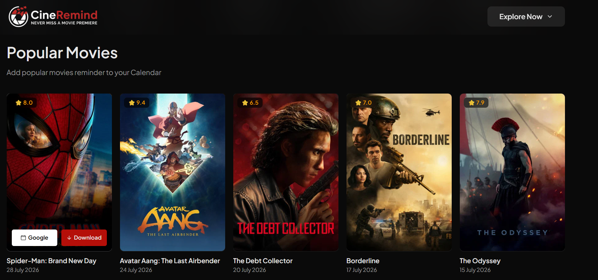

# 🎬 CineRemind

CineRemind is a movie and TV show reminder web application that helps users stay updated with upcoming releases. Users can add release reminders directly to Google Calendar or download `.ics` calendar files compatible with Apple Calendar, Outlook, and other calendar applications.

🌐 **Live Demo:** https://cineremind.netlify.app/

---

## ✨ Features

- Browse Upcoming Movies
- Explore Popular Movies
- Discover Top Rated Movies
- Browse Popular TV Series
- Explore Top Rated TV Series
- Add release reminders to Google Calendar
- Download `.ics` calendar reminder files
- Responsive design for desktop and mobile
- Clean and modern user interface

---

## 🛠️ Tech Stack

- HTML5
- CSS3
- Tailwind CSS
- JavaScript (ES6+)
- TMDB API

---

## 📸 Preview

> Replace `preview.png` with a screenshot of your application.

---

## 🚀 Live Website

https://cineremind.netlify.app/

---

## 🙏 Acknowledgements

- TMDB for providing movie and TV show data.
- Tailwind CSS for the UI framework.

---

## 👨‍💻 Author

**Divij Singh Mehra**

- GitHub: https://github.com/dv-sinmehra
- LinkedIn: https://www.linkedin.com/in/divij-singh-mehra-058367340/